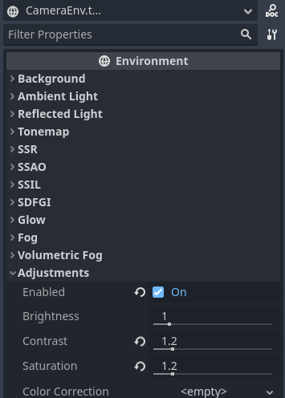

# GodotPy

------
## 起因
2023年1月18日，快过年了，有点时间。

一直在关注godot engine，最近4.0快发布了，共襄盛举。对比成熟引擎，很多人比较过优缺点了。我觉得godot比较简单精致，参与感更强一些。

python现在越来越好，想继续用，况且长远看python在服务器端也有机会一展拳脚。

因此，godot + python 有没有搞头？

其实python是godot抛弃的脚本语言，因为官方解释得很清楚了，gdscript更合适godot的特性。但毕竟那是很久以前的事情了，python和godot都今非昔比。此外找了一下，发现已经有一个python绑定了，但是看着比较重量级。而我只想当脚本用用，越轻量级越好。

第三天，接入过程里，我已经感受到了python的烦人之处了。

差不多第四周，感受到妙处了，引擎的和python的。后续不知道还有几次反转。

好了,6周, 就是python了,真是好用啊.

## python对比lua
在游戏脚本领域，其实lua是更主流的选择，lua来做很多事情就会简单直接很多，比如嵌入扩展啥的。但是，lua本身相比于python，相对弱一些，各种工具和开发者数量上都不足。所以，我还是想尝试一下用python的实现，权当是一次学习。

lua性能好,语言核心小,仅几百k,语言机制简单,使用者变少,开发也不怎么活跃; python语言强,语言核心6M,模块丰富,用户多,增加中. 跟c语言合作不相上下.组织大规模代码时,python更强一些,有不少语法糖,开发活跃. 而且python的GC机制,更加适合游戏这种对卡顿敏感的应用.

## 目录

- Demo: 试验工程，测试和完善GodotPy。作为一个测试工程的同时，也许能让它有点好玩。
- Godot: godot的扩展和构造脚本
- Python: python的构造脚本和扩展

构造说明
1. Python, 把Python目录下面SConstruct, python3.rc, Godot 复制到cpython目录(或者软链接)
   1. d:/cpython/Sconstruct
   2. d:/cpython/python3.rc
   3. d:/cpython/Godot -> d:/GodotPy/Godot
2. godot, 把modules内容复制到godot/modules下, 对node.cpp打patch
   1. d:/godot/modules/GodotPy -> d:/GodotPy/Godot/modules/GodotPy
3. godot/bin, 下面的dll依赖,构造脚本会自动复制. 需要手工创建Lib软连接到cpython/Lib
   1. godot/bin/Lib -> d:/cpython/Lib
4. done

## 协程
协程是个好东西，给godot做一个吧。

## 开发笔记

### 遇到的问题和解决方案

_ready 是子节点先收到，最后是根节点。_enter_tree顺序相反。所以在根节点做了一个MainLoop，用于控制初始化顺序。

scenetree任意一个子树，可以存成tscn(scn表示scene，t表示text)文件，然后复用。类似于prefab。感觉godot更舒服一些，有种面向xml的感觉。
场景文件，tscn格式。用parent字段来维护一个树结构。头部声明 ext_resource，用到的依赖资源。然后在节点里面指定关联。节点定义后，紧接着属性修改。资源用uid来确定。
出现uid重复的处理。把引用错误的资源，reimport，目前遇到的几次是glb里面导入的mesh。
```c++
    // 加载一个场景文件
    Ref<PackedScene> res = ResourceLoader::load(path);
    // 实例化
    auto node = Object::cast_to<Node3D>(res->instantiate(PackedScene::GEN_EDIT_STATE_DISABLED));
    // 加入场景树
    auto st = SceneTree::get_singleton();
    auto scene = st->get_current_scene();
    scene->add_child(node);
```

对node，set_process，才能收到process信号。set_process_input，才能收到input事件。

godot editor, 有一定的remote调试功能，即在编辑器里面启动后，能对scenetree里面的内容，在编辑器和运行时之间有一些反馈。在monitor里面，有详细的fps,drawcall,memory,object count...信息

node只提供了基础功能。node3d才有transform的信息。

没有提供基于组件的开发模式。所以都是用节点来完成的。比如这个python的脚本，我是放了一个FPyObject的节点来提供脚本运行。

ProjectSetting里面有很多宝藏，Cursor，icon...。

gltb格式在导入后，最好把mesh单独保存，这样才能被单独读取。材质也要设置为外部的，不然会从gltb里面把贴图带过来(疑似如此)

Python的Py_INCREF, Py_DECREF，这两项的使用，有一些注意点。目前从容器中Get出来的值是borrowed reference，即，不需要修改引用计数。
注意，PyObject_CallMethod返回值，如果不需要保留，则必须减掉引用计数。如果返回NULL，则说明有运行异常。需要自行打印错误信息。


### GM实现
暂时是单独放了一个文件，用exec()，游戏里加一个按钮来实现的。
以后要做一个呼出的界面

### 支持sqlite3
python本来就支持得挺不错了。把最新的sqlite和python的sqlite module都编译了一下。以后优先在python处理数据。
c++那边主要还是接口和高io，高cpu的代码。


### 对象生命周期
最后为了干净整洁的清理，还是不得不对godot做了一点修改。在Node对象释放之前，通知一下清理
```sh
cd godot
git apply node_cpp.patch
```
### 编译pyc文件发布
1. 原地生成pyc: python -m compileall -b .
2. 删掉__pycache__: fild . -name "*pycache*" -exec rm -rf {} \;
3. 删掉源文件: find . -name "*.py" -exec rm -rf {} \;


其他命令

复制到目标位置，但是似乎没有保留路径，差评
```sh
find game -name "*.pyc" -exec cp "{}" ../Build/py \;
```

### 异常输出

由于godot对stdout,stderr有自己的处理。为了接收python的报错信息，需要做一些额外的处理。看Python的PyErr_Print,最后会调用到python的sys.stdout, sys.stderr的PyObject对象上去write。所以，我的做法是，在boot.py里面，一开始，就把Python的sys.stdout, sys.stderr,换成一个假的IO对象。
```Python
class PrintLine:
    def write(self, s):
        print_line(s)

sys.stderr = PrintLine()
sys.stdout = PrintLine()

```
### 构造发布

windows desktop下面的发布。
1. 构造，scons p=windows tools=no bits=64 -j6 target=template_release，发布版本。命名为Demo.exe
2. 导出数据包，bin\godot.windows.editor.dev.x86_64.console.exe --path h:\GodotPy\Demo -w --export-pack "Windows Desktop" ..\Build\Demo.pck
3. 复制其他依赖的文件，比如Lib, python3.dll，**/*.py
4. 完毕

直接打开工程运行
bin\godot.windows.editor.dev.x86_64.console.exe -w --path d:\OpenSource\GodotPy\Demo

直接打开工程编辑
bin\godot.windows.editor.dev.x86_64.console.exe -w --path d:\OpenSource\GodotPy\Demo -e


### 实现coroutine

先看用例
```python
def co_print_number():
    print(game_mgr.frame_number)
    yield None
    print(game_mgr.frame_number)
    yield None
    print(game_mgr.frame_number)
    yield None
    print(game_mgr.frame_number)
    yield None
    print(game_mgr.frame_number)

    print(OS.get_time())
    yield WaitForSeconds(3)
    print(OS.get_time())

game_mgr.co_mgr.start(co_print_number())
```
coroutine，在用Unity3D的时候，非常喜欢的一个机制，很多小的任务，用timer太麻烦，还有一些精确到帧的任务，都可以用coroutine来做。比如等一帧，等几帧，或者等到某个前置条件成立。Python已经有了异步的机制，async/await关键字的task机制，不过我没有成功。跟unity一样，最后也是利用iterator的yield语句，实现了coroutine。


### 动作系统
从glb里面导出来，包含主要的几个节点:

1. Skeleton:
    看资源信息，肯定是骨骼的绑定数据。
1. MeshInstance:
    指定Mesh信息，Skin信息
1. AnimationPlayer
    从AnimationLibrary里面播放动画

相关的资源有:
Animation: 可以导入时选择单独保存。

AnimationLibrary: Animation的集合，Animation必须在AnimationLibrary才能被使用。

Skin:

Mesh: 可以导入时选择单独保存。

### shader编程
简单的定点动画，旗帜摇摆。

```c
shader_type spatial;
render_mode skip_vertex_transform;

uniform float _speed = 0.7;
uniform float _angle = 10;

void vertex() {
	float rad = fract(TIME * _speed);
	rad = abs(rad - 0.5)*2.0 - 0.5;
	rad = radians(rad * _angle);
	
	float x = cos(rad);
	float z = sin(rad);
	
	mat4 mat_rot_y = mat4(1.0);
	mat_rot_y[0][0] = x;
	mat_rot_y[0][2] = z;
	mat_rot_y[2][0] = -z;
	mat_rot_y[2][2] = x;
	
	VERTEX = (MODELVIEW_MATRIX * mat_rot_y * vec4(VERTEX, 1.0)).xyz;
	NORMAL = normalize((MODELVIEW_MATRIX * vec4(NORMAL, 0.0)).xyz);
}

uniform vec3 _color : source_color;

void fragment() {
	ALBEDO = _color;
}
```

- [Shader文档](https://docs.godotengine.org/en/latest/tutorials/shaders/shader_reference/=-shading_language.html)
- [SpatialShader文档](https://docs.godotengine.org/en/stable/tutorials/shaders/shader_reference/spatial_shader.html)
- [Shader举例](https://docs.godotengine.org/en/latest/tutorials/shaders/your_first_shader/index.html)
- [Shader分享](https://godotshaders.com)
- [Perlin Noise Texture](http://kitfox.com/projects/perlinNoiseMaker)
[柏林噪声介绍](https://zhuanlan.zhihu.com/p/206271895):
Ken Perlin提出了柏林噪声。柏林噪声基于随机，并在此基础上利用缓动曲线进行平滑插值，使得最终得到噪声效果更加趋于自然

[Toon Water](https://roystan.net/articles/toon-water)

### post processing
Camera上新建一个Enviroment，里面配置内置的后处理效果。
glow,fog,volume fog...[官方例子](https://docs.godotengine.org/en/stable/tutorials/3d/environment_and_post_processing.html)，还有[自定义的后处理](
https://docs.godotengine.org/en/stable/tutorials/shaders/custom_postprocessing.html)




### 自定义屏幕特效
[屏幕特效](https://docs.godotengine.org/en/stable/tutorials/shaders/advanced_postprocessing.html)

### object上get，set数据
```c++
bool Control::_set(const StringName &p_name, const Variant &p_value) {
    // ...
}
```
发现Control上面对这个方法override了，导致有数据存不进去。所以，目前企图godot里面的Object*跟Python中的对象一一对应的目的没有实现。

### UI开发
ui自动适配屏幕大小，在Project Settings > Window > Stretch。Mode:canvas_items, Aspect=keep。

[中文字体](https://fonts.google.com/?subset=chinese-simplified&noto.script=Hans)

九宫格(NinePatchRect)，在这里有个特殊的名字，新建一个资源[StyleBoxTexture](https://docs.godotengine.org/zh_CN/stable/classes/class_styleboxtexture.html)。

### Python的用法

python, decorator语法, 是在是太霸气了.
所以,这里的Deco,并不限定是个啥,可以是一个func, 也可以是一个Class
```python
@Deco
def hello():
  pass

# 等价于
def _hello():
  pass
hello = Deco(_hello)
```

一个Property的实现原理

```python
class Prop:
    def __init__(self, value):
        self.value = value

    def __get__(self, obj, owner):
        print('call', obj, owner)
        return self.value


class A:
    x = Prop(1234)
    def __init__(self):
        pass
a = A()

print(a.x)


```

### 内存管理
TODO：现在是放在一个列表，出场景统一清理。以后要做成跟着python的GC走, 可能要给Python一个弱引用。目前是用Capsule上面做的，后面自己做一个容器。

Python的内存用计数器来实现的，一个好处就是内存释放及时，引用计数到0则立即释放。
```Python
class A:
    def __del__(self):
        print(f'delete {self}')

a = A()
a = None 

a = [1,2,A(),3,4]
a = None
```
除非有循环引用，存在环结构，需要通过触发GC，算法里面解环来判断闭合，自动释放。所以，严格的说Python大部分还是可以及时释放的，少部分情况下，会需要GC，会导致卡顿。但相比于mark and sweep，大部分的对象及时释放，所以那个卡顿没那么明显。长久来看，存在的开销有计数+扫描，代价比mark and sweep大，但是导致的卡顿小这个特点，非常适合游戏，用户感知到的卡顿也小。

而且，有必要的话，还可以关闭GC，自己手动解环。

有一些系统会推荐这种用法，临时关闭GC，内存操作，开启GC，暂时规避扫描开销，达到提升性能的目的。

```Python
import gc

gc.isenabled = False

# business code...

gc.isenabled = True

```

Godot里面Object和ObjectId，ObjectId应该是一个不会重复的值。如果重复了，那只能说明太变态了。

### 玩法设计

内政：管理城池的武将，生产，物资。一个单独的UI来实现。

出战：战斗模块，战斗在大地图上完成。

探索：社会事件，获得物品。

#### san9，回合制

和前几代没有太大的变化，仍然是一款以三国历史为背景的策略游戏。

游戏的玩法主要分为三个部分：战斗、经营和政治。

战斗是游戏的核心，玩家可以控制自己的军队，发动攻击，抵抗敌军，攻占城池，完成任务，以及参与各种战役。玩家可以根据自己的战术，指挥士兵，使用各种武器，把握战机，取得胜利。

经营方面，玩家可以管理自己的城池，收集资源，建设农田，建造工厂，招募士兵，发展经济，提高城池的实力。

政治方面，玩家可以参与各种政治活动，如签订条约，结盟，联合攻击，调和纷争，维护社会秩序，以及参与各种政治宣传活动。

总之，《三国志9》是一款综合性的策略游戏，玩家可以根据自己的战略，在战斗、经营和政治三个方面发挥自己的智慧，取得胜利。

#### san11，回合制 + 行动力

本质上来看，是一个抽卡收集类的。然后剩下的事情，就是看运气。太搞笑了。得把史书弄得好看些。

###
为了代码清晰，后面还是需要做一下类型映射。c++对象扔到python这边的时候，创建一个对应的类型，方便定义方法。这块最好是自动生成。


### Blocky
可视化的工具，准备用来做配置，和关卡。
[blockly](https://github.com/google/blockly)

### markdown语法

[marked demo](https://marked.js.org/demo)
[marked](https://github.com/markedjs/marked)


### 查冲内存
有一个思路,冲内存说明有指针指向非法内存,并且写了.所以,只要把被冲内存的地址,在内存里面去搜索.(太残暴了,符合钢铁洪流)
1. WinDbg .s 命令查找内存
2. 有内存越界的锁的技术,在内存前面写一点特殊字节,用来标记边界,当读写的时候,报错
3. VISX DkmProgress + VirtualQuery
4. 硬件断点(数量有限制)

### StableDiffusiopn

组成
1. CLIP: 文本信息转换为图片信息, 文本空间转换成像素空间. 不停的在图像和文本对里面,预测反馈奖励. 生成embeding向量, token, 约束条件来约束生成结果. 文本->像素
2. VAE: 可变编码模型,文本转换为隐空间向量. 图片信息,压缩成一个更低成本的信息,同时解码成新图片. 前后越是像,奖励值越大. 像素->向量
3. Unet: 降噪自编码模型.

个人感觉,国内搞不定这个模型训练,因为成本还是很高的.然后原始数据缺,中文对图片的描述,要补足这个,估计要100年.大量的志愿者和稳定的资金.


### 日志文件

ProjectSetting -> Debug -> File Logging

Log Path: res://logs/godot.log

### c++代码今天分析
python 有 clang 包, 解析源码.


