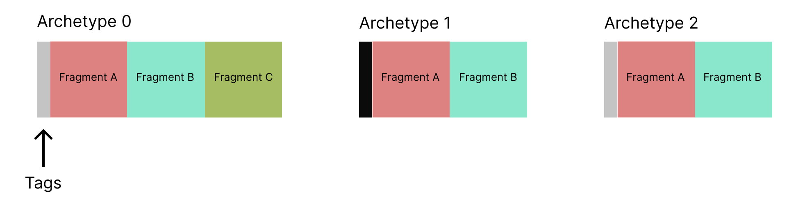

# UE的mass框架学习笔记

Mass是UE5提供的一个ECS框架，从功能上跟U3D的ECS框架类似。框架设计思路，代码结构和用法，也都可以相互印证。

## 原理
传统的数据结构(包括OOP的对象)的内存布局，是定义一个对象，把对象相关的属性包含在内。比较合理，达到了数据和代码的封装。

```c++
class CHero 
{
public:
    FString Name;
    int HP, MaxHP;
    int MP, MaxMP;

    FVector Position;
    FVector Direction;
    FVector Velocity;

    FSkill skills[5];
    float cd;
    // ...


};
```

结构紧凑，所有跟对象相关的属性，都放在一起。从主观理解上是最方便好用。但随着计算机体系架构发展到现在，发现有一点点小瑕疵，在实际业务对缓存命中，不够友好。尤其是游戏，实时渲染领域，对性能的追求锱铢必较，极限榨取。不是说原先的模型不好，而是时至今日，有一些针对性的性能提升方案。牺牲一点代码阅读性，以及码农的一点点开发效率，以期更好的实时运行效率。

现代的CPU体系架构，带着多级缓存，这个缓存内数据的访问性能，相对内存而言，能达到百倍的性能差距。所以我们在购买CPU时，缓存大的，性能更好，价格上面也更贵一些。体现了一分价钱一分货。

在组件+子系统的设计模式的情况下，一个子系统，只对目标对象里面的一部分数据进行处理。比如移动，只处理位置速度朝向，碰撞只处理位置和尺寸等。又比如AI，只对这块功能里定义的数据处理。由于是整块相邻数据被加载进来，并不连续，所以有相当大小的缓存空间是无效缓存。现在，MASS框架就是一些高人在实践中，为了配合组件+子系统的软件架构，更加高效的缓存利用率，从而达到性能的提升，所提出来的一种新的数据组织方式。当我们花了大价钱购买CPU的缓存的情况下，为了让它物有所值，通过一些技术手段改变一些习惯就很合情合理。

## 基本概念



### Fragment
代表一个数据段，包含某个子系统关心的数据块。

例如:
```c++
USTRUCT()
struct GLAI_API FHPFragment : public FMassFragment
{
	GENERATED_BODY()

public:
	float HP;
};
```

### Archetype
名词解释是一个结构定义，是数据段的组合模式。直接对应数据段实际在内存中的分布。

```c++
	Archetype1 = EntityManager->CreateArchetype(
		{
			FHPFragment::StaticStruct(),
			FCoinFragment::StaticStruct(),
		}
	);
```

然后这个模式下的数据，都存在一个大数组里面，这个数组是关联到Archetype1上面的。代码如下：
```c++
FORCEINLINE static FMassArchetypeData& ArchetypeDataFromHandleChecked(const FMassArchetypeHandle& ArchetypeHandle)
{
    check(ArchetypeHandle.IsValid());
    return *ArchetypeHandle.DataPtr.Get();
}
```

### Entity
包含一个下标，指向 FMassArchetypeData 里面的大数组。
以及一个SerialNumber，有效性判断。机制同TWeakObjectPtr。


```c++
// 批量创建
EntityManager->BatchCreateEntities(Archetype1, 100, Entities);
// 创建一个
FMassEntityHandle NewEntity = EntityManager->CreateEntity(Archetype1);
```
其作用相当于在其他业务代码里面，用来访问数据段里面的数据的一个ticket。

```c++
EntityManager->GetFragmentDataChecked<FHPFragment>(NewEntity).HP = 123.456f;
EntityManager->GetFragmentDataChecked<FCoinFragment>(NewEntity).Coin = 112233;
```

### Query
在子系统中，对自己所关心的Archetype的数据，进行批量处理。所以，Mass的意义就在于批量处理。当单个处理的时候，就是通过Index进行了一次寻址访问。

```c++
int UNpcSubsystem::MassTest02()
{
	Archetype1 = EntityManager->CreateArchetype(
		{
			FHPFragment::StaticStruct(),
			FCoinFragment::StaticStruct(),
		}
	);

	TArray<FMassEntityHandle> Entities;
	EntityManager->BatchCreateEntities(Archetype1, 100, Entities);
	
	FMassExecutionContext ExecContext;
	FMassEntityQuery Query;
	Query.AddRequirement<FHPFragment>(EMassFragmentAccess::ReadWrite);

	// 发现这个ForEach，由于数据不一定连续，一个分段会触发一次
	Query.ForEachEntityChunk(*EntityManager, ExecContext, [](FMassExecutionContext& Ctx)
	{
		int Num = Ctx.GetNumEntities();
		UE_LOG(LogTemp, Log, TEXT("MassTest start: Num=%d"), Num);
		TArrayView<FHPFragment> APArray = Ctx.GetMutableFragmentView<FHPFragment>();

		for (int Index = 0; Index < Num; ++Index) 
		{
			APArray[Index].HP = 100;
		}

		UE_LOG(LogTemp, Log, TEXT("MassTest finish"));
	});
	
	return 0;
}
```

Query需要处理的数据段，用AddRequirement来实现。另外还有一个就是对Entity数据打Tag。
```c++
// 打Tag
EntityManager->AddTagToEntity();

// 对应Query
Query.AddTagRequirement();
```

## 工具类

### 动态添加数据段

了解了前面的概念，对下面这个用法肯定是有点迷惑的。
```c++
EntityManager->AddFragmentToEntity(NewEntity, FMoveFragment::StaticStruct());
```
因为先要定义Archetype, 才能创建Entity。这里动态往Entity里面加数据段，岂不是破坏了前面的大数组的结构。

这里看了一下实现，发现还是遵守了这个规则的。实际操作是，偷偷创建了一个新的Archetype2，重新定义结构模式，在原有数据段的后面，添加新的数据段。并把Entity里面的Index，SerialNumber更新，指向新的Archetype2。

### Processor

把Query的流程封装了一下，规范使用。

```c++
UCLASS()
class GLAI_API UNpcProcessor : public UMassProcessor 
{
	GENERATED_BODY()

public:
	UNpcProcessor();
	virtual void Execute(FMassEntityManager& EntityManager, FMassExecutionContext& Context) override;
	virtual void ConfigureQueries() override;

protected:
	FMassEntityQuery Query;
};
```

## Unity3D的做法

Unity的开发语言是C#来做的，所以额外提供了一个Burst的编译器，用来提供基础的数据重排服务。并且基于llvm，提供了一些串行化指令的优化。C#层的引入，也算是有利有弊。


## 参考资料

由于Mass框架还在试验阶段，所以代码和结构持续变化中，文档和代码实践相对欠缺一点。网上找到的一些参考资料，有一些接口和类过时了，大致还能看出来原意。

[UE5的ECS：MASS框架](https://zhuanlan.zhihu.com/p/441773595)

[MassSample](https://github.com/Megafunk/MassSample)


